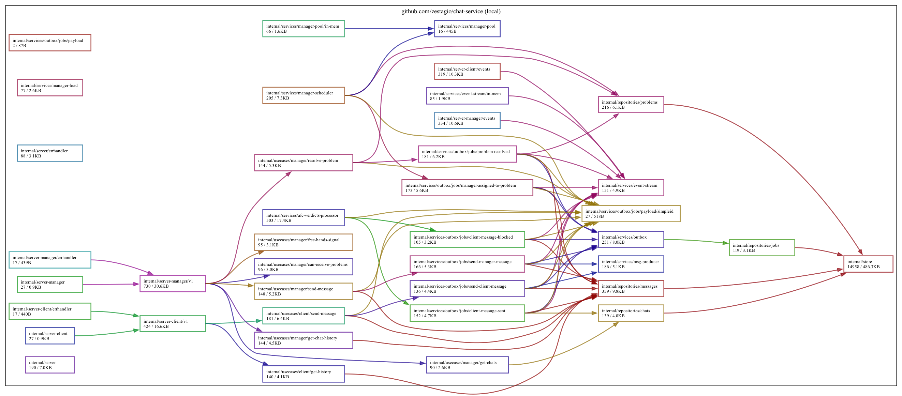
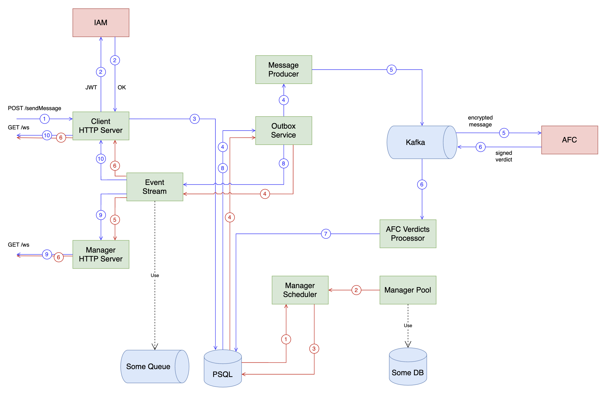

[![CC BY-NC-SA 4.0][cc-by-nc-sa-shield]][cc-by-nc-sa]

[cc-by-nc-sa]: http://creativecommons.org/licenses/by-nc-sa/4.0/
[cc-by-nc-sa-shield]: https://img.shields.io/badge/License-CC%20BY--NC--SA%204.0-lightgrey.svg

# Bank Support Chat System

Provides possibility to communicate clients and bank support managers. All messages go through AFC
(Anti-Financial Crime - external dependency isolated through the docker container) before reaching the manager.

## Launch
To run commands need to install [Task](https://taskfile.dev/).

```bash
$ git clone git@github.com:zestagio/chat-service.git
$ cd chat-service
$ cp .env.example .env
$ cp configs/config.example.toml configs/config.toml

# Start docker containers
$ task deps

# Start backend service - debug server accessible at http://localhost:8079/
$ go run cmd/chat-service/main.go

# Start ui-client - accessible at http://localhost:3000/
$ go run cmd/ui-client/main.go

# Start ui-manager - accessible at http://localhost:3001/
$ go run cmd/ui-manager/main.go
```
## Tests
```bash
# Run unit tests
$ task tests

# Run integration tests
$ task tests:integration

# Run e2e tests
$ task tests:e2e
```

## Dependency graph
```bash
# Generate dependency graph
$ task gen:deps-graph
```


## Architecture

